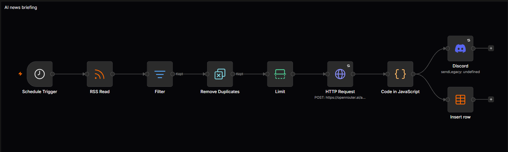
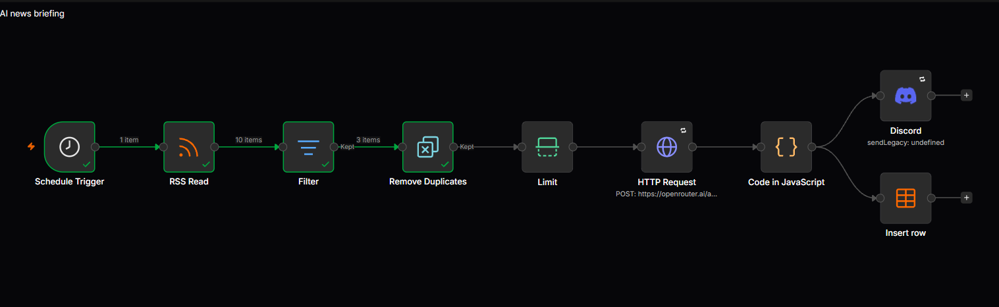
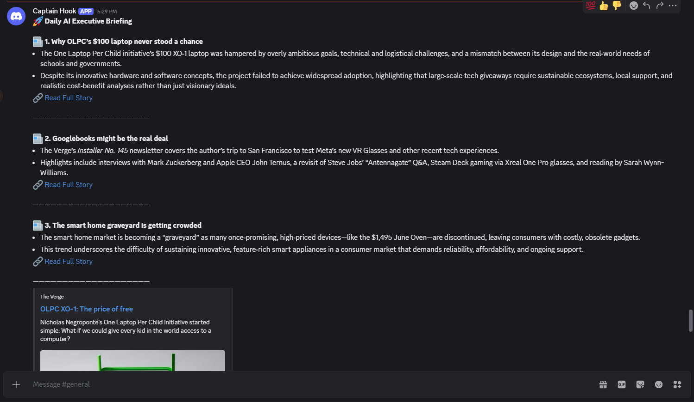
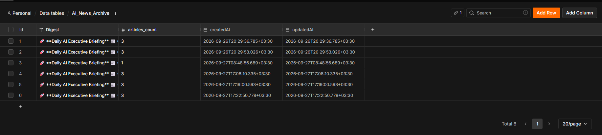

# ai-news-briefing-n8n
Autonomous RSS-to-Discord intelligence engine built with n8n, OpenRouter LLMs, and Data Table persistence.
# Automated AI Executive News Pipeline

A robust, automated pipeline designed to aggregate, synthesize, and distribute technology news briefings. Built on n8n, this system processes RSS feeds, performs intelligent deduplication, leverages LLM-based summarization, and archives data into structured storage.

---

## System Architecture

### Execution Pipeline
1. **Schedule Trigger:** Automated execution cycles triggered every 8 hours.
2. **RSS Aggregation:** Ingestion of tech-industry RSS feeds (e.g., TechCrunch).
3. **Time-Window Filtering:** Temporal validation to process only recent publications (`{{ $json.isoDate > $now.minus({ hours: 8 }) }}`).
4. **Deduplication Engine:** State-based tracking of article identifiers (`link`) to prevent redundant alerts across execution cycles.
5. **Rate Limiting:** Normalization of batch outputs to maintain briefing density.
6. **LLM Summarization:** Integration with OpenRouter/Groq API (`openai/gpt-oss-120b`) for executive summary generation.
7. **Formatting:** Data transformation via JavaScript for standardized markdown output.
8. **Output Routing:**
    - **Discord:** Real-time distribution of formatted briefings via Webhook.
    - **Persistence:** Metadata archiving into internal n8n database (`AI_News_Archive`).

---

## Execution & Outputs

### Pipeline Execution

### Distribution (Discord)

### Database Archival (`AI_News_Archive`)

---

## Technical Specifications

- **Orchestration:** n8n (Production-ready)
- **AI Engine:** OpenRouter / Groq API (`openai/gpt-oss-120b`)
- **Integration:** RSS Feed / Discord Webhook API
- **Storage:** Internal n8n Data Tables
- **Logic:** ES6 JavaScript for parsing and schema transformation

---

## Implementation

### Prerequisites
- n8n instance (v1.x+)
- API Key (OpenRouter or Groq)
- Discord Webhook URL

### Deployment
1. **Import:** Import `workflow.json` into your n8n canvas.
2. **Configuration:**
   - **Authentication:** Add your API Key to the `HTTP Request` node headers (`Authorization: Bearer <KEY>`).
   - **Discord:** Input your Webhook URL into the Discord output node.
   - **Database:** Verify the existence of the `AI_News_Archive` table with columns: `Digest` (String), `articles_count` (Number).
3. **Activation:** Enable the workflow to initiate the automated cycle.

---

## Reliability Features
- **Deterministic Filtering:** Execution halts downstream if no content meets criteria, minimizing token waste.
- **Cross-Run State Management:** Built-in deduplication ensures no duplicate alerts across RSS updates.
- **Error Handling:** Graceful failure handling prevents downstream service disruption.

---

## License
Distributed under the MIT License. See `LICENSE` for details.
